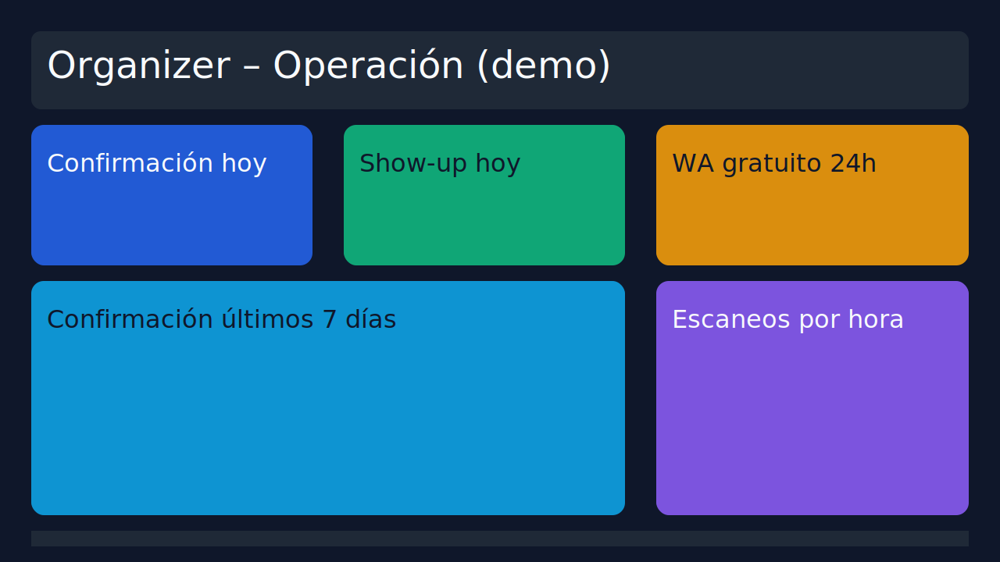

# Metabase para analistas (servicio opcional)

Metabase es el contenedor de BI ligero del stack de Monotickets. Permite explorar las tablas operativas, las bitácoras de envíos y las vistas materializadas de KPIs sin exponer credenciales en el repositorio.

## Puesta en marcha

1. Asegúrate de tener la base de datos levantada (ver `docs/db/README.md`). Después inicia Metabase:

   ```bash
   docker compose -f infra/docker-compose.yml up -d database metabase
   ```

   - El servicio se expone en [http://localhost:3002](http://localhost:3002).
   - El metastore se guarda en el volumen `metabase_data` (`MB_DB_FILE=/metabase-data/metabase.db`).

2. Onboarding inicial:
   - Crea el usuario administrador cuando Metabase lo solicite.
   - Configura una conexión PostgreSQL apuntando al mismo host que usa el backend (variables de `.env`):
     - **Host**: `database`
     - **Puerto**: `${DB_PORT:-5432}`
     - **Base de datos**: `${DB_NAME:-monotickets}`
     - **Usuario**: `${DB_USER:-postgres}`
     - **Contraseña**: `${DB_PASSWORD}`
   - También puedes omitir la conexión en el onboarding y agregarla después en *Admin settings → Databases*.

## Automatización de dashboards

El script `scripts/bi/setup-metabase-dashboards.js` crea colecciones, tarjetas y dashboards para **Organizer – Operación** y **Director – Ejecutivo** usando la API de Metabase. También asigna permisos de lectura a los grupos configurados y aplica filtros parametrizados por evento y organizador. Las tarjetas se alimentan del dataset demo actualizado (eventos *Gala Innovación 2024*, *Summit Premium Riviera* y *After Office Backstage*), generado por la migración `infra/migrations/040_seed.sql`.

### Variables necesarias

Configura las siguientes variables/secrets antes de ejecutar el script (local o CI):

| Variable | Descripción |
| --- | --- |
| `METABASE_SITE_URL` | URL base del Metabase (por ejemplo `https://metabase.staging.monotickets.test`). |
| `METABASE_DATABASE_ID` | ID interno de la base de datos PostgreSQL configurada en Metabase. |
| `METABASE_SESSION_TOKEN` **o** (`METABASE_USERNAME`, `METABASE_PASSWORD`) | Credenciales para autenticarse contra la API. |
| `METABASE_ORGANIZER_GROUP_ID` | ID del grupo que debe ver el dashboard operativo. |
| `METABASE_DIRECTOR_GROUP_ID` | ID del grupo con acceso al dashboard ejecutivo. |

Los jobs de CI usan secrets homónimos y un repo variable `METABASE_DASHBOARDS_ENABLED=true` para habilitar la tarea opcional.

### Ejecución manual

```bash
METABASE_SITE_URL=https://metabase.local \
METABASE_USERNAME=admin@monotickets.test \
METABASE_PASSWORD=supersecret \
METABASE_DATABASE_ID=2 \
METABASE_ORGANIZER_GROUP_ID=5 \
METABASE_DIRECTOR_GROUP_ID=6 \
npm run setup:metabase
```

El script refresca o crea:

- Colecciones: `Monotickets – Dashboards`, `Organizer – Operación`, `Director – Ejecutivo`.
- Tarjetas parametrizadas (`event_id`, `organizer_id`) construidas sobre las vistas materializadas y tablas operativas nuevas:
  - `Confirmación hoy`, `Show-up hoy`, `Ratio WA gratuito 24h` (usa `delivery_logs.is_free` + `wa_sessions`).
  - `Confirmación últimos 7 días`, `Escaneos por hora (hoy)`.
  - `Mix de tipos de evento`, `Organizadores activos (90d)`, `Deuda abierta`, `Top organizadores por tickets` y `Invitados (detalle)` en la colección ejecutiva.
- Dashboards con descripciones que apuntan a `wa_sessions` y a los enlaces `invites.links` para trazabilidad sin heurísticas.

### Integración continua

El workflow `ci.yml` incluye el job opcional **Sync Metabase Dashboards**, que:

1. Refresca las vistas materializadas de BI en staging mediante `infra/refresh-bi-views.sh`.
2. Ejecuta `npm run setup:metabase` para actualizar colecciones y dashboards.

Activa el job definiendo `METABASE_DASHBOARDS_ENABLED=true` en *Repository Variables* y cargando los secrets `STAGING_DB_*`, `METABASE_*` mencionados arriba.

## Datos de demostración

- **Eventos**: la semilla crea tres eventos activos (dos futuros, uno en curso) para probar dashboards diarios y comparativos.
- **Invitados**: 16 invitados por evento con estados `pending`, `confirmed`, `scanned` y confirmaciones mixtas (WhatsApp/email).
- **Sesiones**: `wa_sessions` incluye registros con `metadata` (`guest_id`, `event_id`) y ventanas de expiración distribuidas para graficar el ratio gratuito.
- **Mensajería**: `delivery_logs` incorpora `is_free`, `session_id` y distintos estatus (`queued`, `sent`, `delivered`, `failed`) para validar los KPIs.
- **Finanzas**: `ticket_ledger` y `payments` extienden los movimientos para alimentar el dashboard ejecutivo.

## Verificación

- Dashboard operativo: [Organizer – Operación](https://metabase.staging.monotickets.test/dashboard/organizer-operacion) (filtros por evento y organizador activos).
- Dashboard ejecutivo: [Director – Ejecutivo](https://metabase.staging.monotickets.test/dashboard/director-ejecutivo) (las notas explican cómo `is_free` y `wa_sessions` alimentan el ratio).
- Captura de referencia: 

Actualiza la captura cuando cambie el layout o la cobertura de KPIs.

## Buenas prácticas de dashboard

- **Foco diario**: aplica filtros rápidos (hoy, últimos 7 días) para validar confirmaciones y show-up recientes.
- **Drill-down**: enlaza tablas detalladas que permitan auditar invitados, invitaciones y delivery logs directamente desde los indicadores.
- **WhatsApp gratuito**: usa directamente la columna `is_free` de `delivery_logs` (expone la sesión activa en `wa_sessions`). El ratio diario vive en `mv_wa_free_ratio_daily`.
- **Rendimiento**: las vistas materializadas (`mv_*`) se refrescan con `REFRESH MATERIALIZED VIEW CONCURRENTLY`; evita consultas pesadas directamente sobre `scan_logs` históricos.

## Próximos pasos

- Regenera los dashboards automáticamente cada vez que cambien las tarjetas base ejecutando nuevamente `npm run setup:metabase` (o re-lanzando el job de CI manualmente).
- Para análisis ejecutivos considera compartir vistas de `mv_event_mix_90d` y `mv_organizer_debt` en dashboards dedicados (ver `docs/bi/metabase-dashboards.md`).
