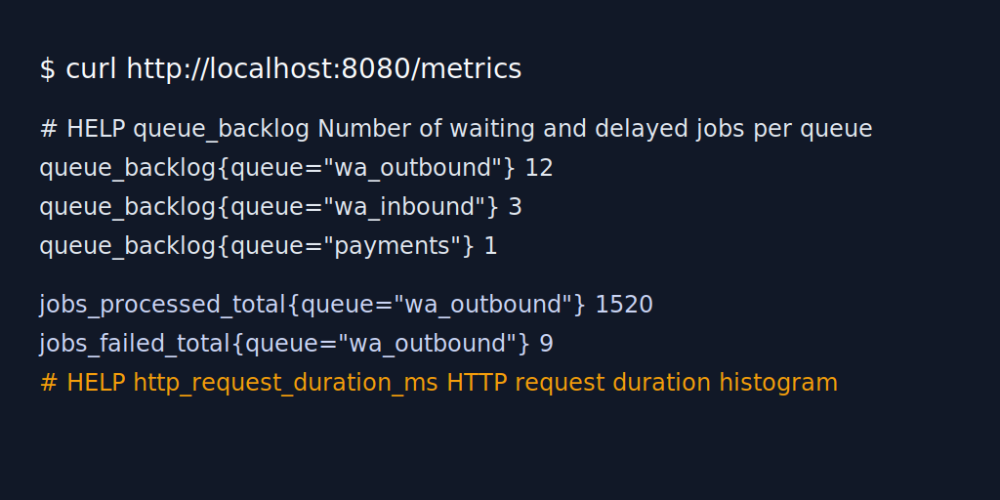

# Observability Guide

This guide documents the initial observability surface for Monotickets. It
covers structured logs, metrics, dashboards, and alert recommendations.

## Structured logging

- Set `LOG_FORMAT=json` in `.env` (or the templates under `env/`) to switch
  backend and worker logs to JSON. When omitted, logs stay in a concise text
  format for developer ergonomics.
- `CORRELATION_HEADER` defaults to `X-Request-Id`. Incoming requests that set
  this header keep the value across responses, logs, and downstream queue jobs.
- Each log entry includes:
  - `ts`: ISO 8601 timestamp (UTC).
  - `level`: log severity (`info`, `warn`, `error`, `fatal`).
  - `service`: emitter (`backend-api`, `workers`, etc.).
  - `req_id` / `request_id`: request correlation ID (mirrors `x-request-id`).
  - `path`, `status`, `latency_ms`: populated for HTTP handlers.
  - `event_id`: included for `/scan/validate` traffic when available.
- Logs default to plain text when `LOG_FORMAT` is not set to `json` to keep
  developer ergonomics.
- Loki pipelines (see `infra/monitoring/loki.example.yml`) parse JSON payloads to
  expose keys as labels (`{service="backend-api"}`) for querying.
- Force correlation IDs in ad-hoc calls with:

  ```bash
  curl -H "x-request-id: demo-123" http://localhost:8080/events/demo-event/guests
  ```

  The same `demo-123` identifier will appear in logs for downstream worker jobs.

## Metrics

- The backend exposes Prometheus-compatible metrics at `GET /metrics` (see the
  sample capture below). The endpoint mezcla los contadores HTTP con la
  instrumentación de BullMQ para mantener una única superficie de scraping.
- Histogram name: `http_request_duration_ms` with `_bucket`, `_sum`, `_count`
  series. Buckets follow `[5,10,25,50,100,250,500,1000,2500,5000,+Inf]` ms and
  include the labels `service`, `method`, `route`, `status`.
- Counter: `http_requests_total{service,method,route,status}` surfaces total
  processed requests and enables error-rate ratios together with
  `http_requests_5xx_total{service,method,route}`.
- BullMQ gauges and counters:
  - `queue_backlog{service,queue}` reports waiting + delayed jobs for every tracked
    queue (`wa_outbound`, `wa_inbound`, `payments`, `email`, `pdf`,
    `delivery_failed`). Values come from `queue_metrics_snapshot` logs emitted
    by API y worker cada `QUEUE_METRICS_INTERVAL_MS` (default 30 s).
  - `jobs_failed_total{service,queue}` increases whenever queue processors emit
    `failed` events (DLQ transitions are logged separately to avoid double
    counting).
  - `jobs_processed_total{service,queue}` increments for every successful completion and
    enables failure-rate calculations together with `jobs_failed_total`.
- Suggested Prometheus scrape configuration lives in
  `infra/monitoring/prometheus.example.yml`. Update the targets if the compose
  project name changes.



### BullMQ instrumentation

- API y worker ejecutan `scheduleQueueMetrics`/`attachQueueObservers`, lo que
  emite logs `queue_metrics_snapshot` y `queue_metrics` con contadores de
  `waiting`, `delayed`, `active`, `completed`, `failed`, `deadLetter`.
- Ajusta `QUEUE_METRICS_INTERVAL_MS` si necesitas granularidad distinta para el
  monitoreo (30 s local, 60 s staging/producción recomendado).
- Los eventos `queue_job_failed`, `queue_job_dead_letter` y
  `queue_job_completed` incluyen `request_id` cuando está disponible, lo que
  facilita correlacionar reintentos y DLQs en Loki.

Key queries:

- `histogram_quantile(0.95, sum(rate(http_request_duration_ms_bucket{service="backend-api",route="/scan/validate"}[5m])) by (le))`
  → p95 latency for QR validation.
- `histogram_quantile(0.99, sum(rate(http_request_duration_ms_bucket{service="backend-api",route=~"/events/.+"}[5m])) by (le, route))`
  → p99 latency for events APIs.
- `sum(rate(http_requests_5xx_total{service="backend-api"}[5m])) / sum(rate(http_requests_total{service="backend-api"}[5m]))`
  → aggregate HTTP error rate.
- `queue_backlog{service="backend-api",queue=~"wa_outbound|wa_inbound|payments"}` → current backlog
  for messaging and payment workers.
- `sum(rate(jobs_failed_total{service="backend-api",queue=~"wa_outbound|wa_inbound|payments"}[15m]))`
  → failure throughput per queue.
- `sum(increase(jobs_failed_total{service="backend-api",queue=~"wa_outbound|wa_inbound|payments"}[15m])) /
   clamp_min(sum(increase(jobs_processed_total{service="backend-api",queue=~"wa_outbound|wa_inbound|payments"}[15m])) +
   sum(increase(jobs_failed_total{service="backend-api",queue=~"wa_outbound|wa_inbound|payments"}[15m])), 1)` → queue
  failure ratio.

### Scraping instructions

1. Copy `infra/monitoring/prometheus.example.yml` to `infra/monitoring/prometheus.yml`.
2. Update the `targets` array with the reachable hostnames (e.g. `backend-api:8080`).
3. Run Prometheus locally:
   ```bash
   docker run --rm -it -v $(pwd)/infra/monitoring/prometheus.yml:/etc/prometheus/prometheus.yml \
     -p 9090:9090 prom/prometheus
   ```
4. Navigate to `http://localhost:9090` and query
   `histogram_quantile(0.95, sum(rate(http_request_duration_ms_bucket[5m])) by (le, route))`.

### Grafana dashboards

- `infra/monitoring/grafana-dashboards/latency-api.json` ships with latency,
  queue backlog, and queue failure trend panels. Import it into Grafana and set
  the datasource to `Prometheus` (`PROMETHEUS_DS`).
- Recommended additions:
  - Keep the p95 latency timeseries to spot HTTP regressions.
  - Use the "Queue backlog (jobs)" timeseries to visualise
    `queue_backlog{queue=~"wa_outbound|wa_inbound|payments"}`; thresholds mark
    warning (>50) and critical (>100) backlogs.
  - Monitor "Queue failures (5m increase)" to highlight spikes in
    `increase(jobs_failed_total[5m])`.
  - Add a stat panel for the queue failure ratio query (above) if proactive
    alerting is required.

## Alerting recommendations

When integrating Alertmanager or equivalent, use the following baseline rules:

```yaml
# p95 latency above 300 ms for 5 minutes
a- latency_high:
    expr: histogram_quantile(0.95, sum(rate(http_request_duration_ms_bucket{service="backend-api"}[5m])) by (le, route)) > 0.3
    for: 5m
    labels:
      severity: warning
    annotations:
      summary: "Backend p95 latency high"
      description: "p95 latency {{ $value }}s for {{ $labels.route }}"

# HTTP error rate > 2% across all endpoints
a- error_rate_high:
    expr: sum(rate(http_requests_5xx_total{service="backend-api"}[10m])) / sum(rate(http_requests_total{service="backend-api"}[10m])) > 0.02
    for: 10m
    labels:
      severity: critical
    annotations:
      summary: "HTTP 5xx rate above 2%"

# Queue backlog above 100 jobs for 10 minutes
a- queue_backlog_high:
    expr: max(sum by (queue) (queue_backlog{service="backend-api",queue=~"wa_outbound|wa_inbound|payments"})) > 100
    for: 10m
    labels:
      severity: warning
    annotations:
      summary: "Queue backlog elevated"
      description: "{{ $labels.queue }} backlog is {{ $value }} jobs"

# Queue failure ratio > 1% over 15 minutes
a- queue_failure_ratio_high:
    expr: sum(increase(jobs_failed_total{service="backend-api",queue=~"wa_outbound|wa_inbound|payments"}[15m])) /
      clamp_min(sum(increase(jobs_processed_total{service="backend-api",queue=~"wa_outbound|wa_inbound|payments"}[15m])) +
      sum(increase(jobs_failed_total{service="backend-api",queue=~"wa_outbound|wa_inbound|payments"}[15m])), 1) > 0.01
    for: 15m
    labels:
      severity: critical
    annotations:
      summary: "Queue failure ratio above 1%"
      description: "Failures affecting {{ $labels.queue }} exceed 1%"

# Queue stuck active for 15 minutes (BullMQ watchdog)
a- queue_stuck_active:
    expr: max_over_time(queue_backlog{queue=~"wa_outbound|wa_inbound|payments"}[5m]) > 0
      and sum(rate(jobs_processed_total{queue=~"wa_outbound|wa_inbound|payments"}[15m])) == 0
    for: 15m
    labels:
      severity: warning
    annotations:
      summary: "BullMQ queue has backlog but no throughput"
      description: "{{ $labels.queue }} backlog growing without completed jobs"
```

> Replace `a-` with your alert group naming convention.

## Log aggregation (Loki stub)

- Copy `infra/monitoring/loki.example.yml` to `infra/monitoring/loki.yml` when
  ready. It includes a pipeline stage to parse JSON logs via `docker` driver.
- Deploy Grafana Loki locally together with Promtail using Docker Compose
  override files. Sample command:
  ```bash
  docker compose -f infra/docker-compose.yml -f infra/monitoring/docker-compose.override.yml up -d loki promtail
  ```
  (Create the override file before running the command.)

## Maintenance tasks

- Rotate `LOG_FORMAT=json` on staging before load tests to capture structured
  output.
- Archive Prometheus data before upgrades by snapshotting the TSDB directory.
- Document any new metrics or dashboards in this file and update
  `docs/load-tests.md` with guidance for QA teams.
